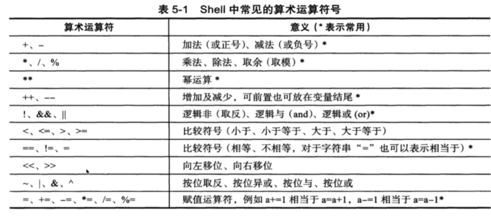

# Bash SHELL 语言脚本

## 常用命令
---
### 1. history 命令

```shell
查看历史命令
- c  清空记录
- r  恢复历史命令

!+历史ID : 快速执行历史命令
！! : 	执行上一次命令
```

### 2. ps 命令

```shell
-f : 显示 pid,uid,ppid
-e : 列出所有进程信息，如同 -a
--forest
```

### 3. 内置命令与外置命令

- 使用 type command 查看

- 内置命令：系统启动时载入内存，效率高，占用资源（cd）

- 外部命令：需要从硬盘中读取，载入内存(ps,vim)

  > 内置命令不会创建子进程执行，和shell是一体的

### 4.  who 命令

查看有哪些用户登录了系统

### 5. netstat
```shell
netstat -ano | findstr 8080 #查看端口是否被使用
```

##  变量

1. a=1 赋值中间不能有空格

2. 作用域
  1.  父shell 不能传 变量 给 子shell，一般定义的都是局部变量
  2.  环境变量是全局的

3.  特殊变量 $? 0-255 返回上一次操作的状态码

4.  单双引号区别：

   - 单引号变量，不能识别特殊语法

   - 双引号变量，可以识别

     ```shell
     var=123
     var2='${var}'
     var3="${var}"
     ehco $var2		# ${var}
     ehco $var3		# 123
     ```

5. 不同的shell 使用不同变量，

   - 每次调用bash file 都会开启一个新的子shell， 变量不会保存到当前shell中

   - 使用 source 或 . 执行 是在当前环境加载脚本，保留变量

### 1. 反引号

让命令执行的结果保留下来

```shell
lsf=`ls`
echo $lsf
```

### 2. 环境变量设置

- ~/.bash_profile 用户个人配置文件  ~/.bashrc 远程登陆用户特有文件

- /etc/profile、 /etc/bashrc 全局配置文件 ,最好在/etc/profile.d ，而非直接修改系统文件

---

#### 检查系统变量命令

- set ： 查看当前shell所有变量，包括 local varriable
- env :   只显示全局变量
- declare : 等同 set
- export : 显示和设置环境变量值
- unset : 删除变量或函数
- readonly : 当前shell 只读

```shell
#把export 结果用' ',':',"="分开格式化，打印第三列
export | awk -F '[ :=]' '{print $3}'
```

---

#### 环境变量加载初始顺序

/etc/profile ==>  /etc/profile.d 

==> $HOME/.bash_profile ==> $HOME/.bashrc  

==> /etc/.bashrc


### 3. 特殊变量

   ```shell
   bash file.sh -a -b -c 
   $0 : 获取脚本文件名，以及脚本路路径
   $n ：获取shell脚本的第n个参数， 大于9需要${10},参数空格隔开
   $# : 获取执行shell脚本的参数总个数
   $* : 获取shell脚本所有参数，不加引号等同于$@,"$*"接收参数为单个字符串"$1 $2 $3"
   $@ : 把参数装进字符串数组
   
   ```

### 4. 面试题

```shell
$* 和 $@ 的区别
收集所有参数
$* 把所有参数 当成一个字符串
$@ 把每个参数 当作一个字符串
```


### 5. 特殊状态变量

```shell
$? : 上一次命令返回值,0正确，非0错误代码
$$ : 当前shell脚本的进程号
$! ：上一次后台进程的pid
$_ : 获取上次命令的最后一个参数
```

### 6. 让命令后台运行

```shell
nohup commnd ... & 1> /dev/null
```

### 7. 扩展变量

```shell
#当parameter变量为空时
result=${parameter:-word}	# 返回word,赋值给result
result=${parameter:=word}	# 用word替代变量,返回其值
result=${parameter:?word}	# word当作stderr输出
result=${parameter:+word}	# 什么都不做，否则返回word
```


---

## Shell 子串

### 1. bash 一些基础内置命令

```shell
eval ： 执行多个命令 # eval ls;cd /tmp
exec : 不创建子进程，执行完成后自动 exit
export :
read :

```

```shell	
-n 不换行打印
-e 让 echo 识别特殊符号
```

### 2. 子串操作

| command                | 用法                                 |
|:---------------------- |:------------------------------------ :|
| ${#var}                | 返回变量长度                         |
| ${var:start}           | 返回 offset 数值之后的字符           |
| ${var:start:length}    |                                      |
| ${var#word}            | 从变量 开头 删除 最短匹配的 word子串 |
| ${var##word}           | 从变量开头删除 最长的                |
| ${var%word}            | 从 结尾 删除 最短                    |
 | $`{var%%word}`         | 从 结尾 删除 最长                    
| ${var/pattern/string}  | 用 string 代替第一个匹配的 pattern   |
| ${var//pattern/string} | 用 string 代替 所有 pattern          |

## 数值计算

### 1. 运算符


```shell
or file_name in `ls *str*.jpg`;
		do mv $file_name `echo ${file_name//str/}`
	done
```
		


### 2.  数据备份，删除过期的脚本

```shell
find | xargs

cat del_data.sh
# 如果path不存在就会在当前目录操作
find ${path} -name '*.tar.gz' -type f -mtime+7|xargx rm -f
# 改进
find ${path:=/data/temp} -name '*.tar.gz' -type f -mtime+7|xargx rm -f
```

### 3. 进程列表(子shell)

- （） 小括号 把括号里的结果交给括号外

-   (()) 双小括号，在内进行数学运算

  ~~~shell
  echo $((6>7))
  ~~~

## 案例

 ### 1. 批量修改文件名

```shell
1. 单个文件修改
2. 利用文件字串功能
	echo ${f//str/}
3. 利用反引号
	echo $f
	mv $f `echo ${f//str/}`
4. 批量替换
	echo `ls *str*.jpg`
	for file_name in `ls *str*.jpg`;
		do mv $file_name `echo ${file_name//str/}`
	done
	

```

### 2.  数据备份，删除过期的脚本

```shell
find | xargs

cat del_data.sh
# 如果path不存在就会在当前目录操作
find ${path} -name '*.tar.gz' -type f -mtime+7|xargx rm -f
# 改进
find ${path:=/data/temp} -name '*.tar.gz' -type f -mtime+7|xargx rm -f
```

### 3. 进程列表(子shell)

- 创建子shell执行命令
	```shell
	(cd ~/Code;pwd;ls;cd;echo $BASH_SUBSHELL)
	```

- 子shell 嵌套

  ```shell
  (pwd;(pwd;(echo $BASH_SUBSHELL)))
  ```


## Control Flow

### 条件判断
if \<condition\> ; then [command] ; fi

```shell 
if [ -para FILE ]
	or
if [ FILE1 -para FILE2 ]
	or
if [ stra[OPERATOR]strb ]

```
 
```shell
a="hello"	
b="hell"
if [ -n a ] ; then
	if [ a = b ]; then
		echo "equal"
	elif [ a != b ] 
	then
		echo "not equal"
	fi
else 
	echo "a not exist!"
fi
```

``` shell
if [ $var ]...   判断变量是否存在
if [ $var == str ]... 判断变量相等
if [ -z str ]... empty string
if [ -n str ]... str_len > 0
```
