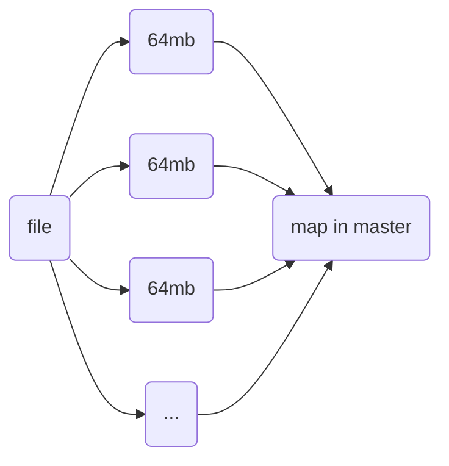

# Distribute and GFS

## Implementation
- RPC
- threads
- lock
- concurrency 并发
## Performance
- Scalability (可扩展性 机器数量)

## Fault Tolerance
- Availability 可用性
- Recoverability 可恢复性
- Replication 副本
- NV Stroge
- consistency 一致性 (key)

## GFS
Google File System

- Why Hard?
purpose: high performance

     high  performance --> Sharding(Ditribute)
	 Faults --> Tolerance
	 Tolerance --> Replication
	 Replication --> Consistency一致性
	 Consistency --> Low Performance
	
- 以弱一致性来获取更高的性能(google in 2003)
- Automatically recovery
- Master/Slaver copy

### How to grantee consistency
---
File are split in numerable chunks in  different machines

Mater Data:
- File name -> array of chunk-handle(id) (nv 易失性 on disk)
- per chunk-handle 
	- --> list of chunks-servers (v on memory)
	--> version of each chunk (nv disk)
	--> Primary (v memory)
	--> lease expiration time (v memory)
- Log, Checkpoints --- DISK

>Primary : 最新版本的chunk， 最后一次写入的地方
### READ
#### When server receive a read request from Client
1. Server send Filename, Offset --> M(Master)
2. M send **Chunk handle**,  **List of Server** to client
	- Client find close server
	- Cache this chunk by server
3. Client contact to Chunk Server , return data

####  When a read > 64MB data 
(out of one chunk range),
1. **Library** will be handled by program, 
2. **split** and **consider as Multiple Request**
3. send to different Chunk Server
4. Library Combine as one response

### Write
#### A write operation 
- No Primary:
	1. Master find the up to date Replication(大于等于持有的newest ver, 否则回应报错，等候)
	2. Update the version of this replication to master's newest version
	3. Pick a CS(chunk server) as **Primary**, else CS will be assist.
	4. Set the latest version to these servers (更新版本) - Lease(约定60s 一个server 为 primary 来进行处理)
	5. Write the Version Number of Master to disk after tell Primary

- 记录一些 Primary 和 Secondary (备用的，一致性相对较高的)
- 暂时记录于 Primary 的一个 memory offset 上,  然后回复 ACK
- 如果失败， re-execute

####  "SPLIT BRAIN"
- 存在两个 primary
- 网络原因，primary 无法 contact to master
- 客户端收到master 发送的primary 信息， 但是发送时，这个primary挂掉了

#### A primary (备用master) 存储数据 replication 失败
- A, B, C save a chunk *D*, 但是 C 存储失败
- 在存储下一份时， 会 return error, 然后 ABC 一起再写入一份 *D*, 同时更新版本号
- 再写入新的 chunk

								
	
