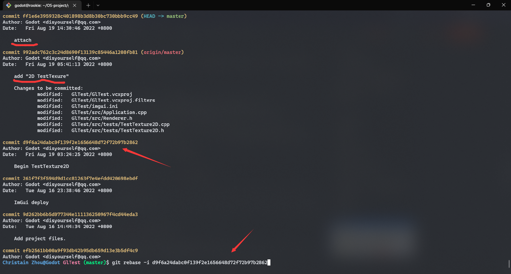

# 追加到上一次提交

## 1. git commit -amend 追加提交

## 2. git rebase 合并多次提交

```shell
git rebase -i [startpoint] [endpoint]

-i:--interactive 

git rebase -i [one commit uuid]: 指定一个左闭右开区间
```

 - We rebase the commit before "add '2D TestTexture' "
 
- It looks like this: 
  
  
```shell
-   p:pick：保留该commit
-   r:reword：保留该commit，但我需要修改该commit的注释
-   e:edit：保留该commit, 但我要停下来修改该提交(不仅仅修改注释)
-   s:squash：将该commit和前一个commit合并
-   f:fixup：将该commit和前一个commit合并，但我不要保留该提交的注释信息
-   x:exec：执行shell命令
-   d:drop：我要丢弃该commit
```

- So we change `pick` of **attach** to `s` or `squash`, then `:wq` type `git rebase --continue`
- [x] It merge as one single commit 
